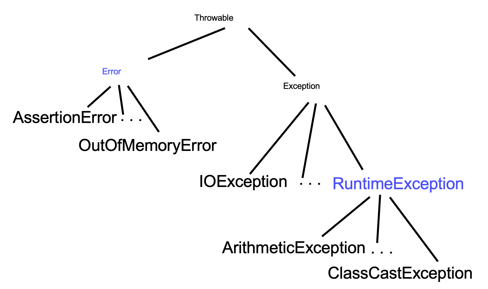

# Week 4

## 1. Getters, Setters, Public variables

* Case 1: The value of the variable may be changed for some reasons.

    Example: Person class has variable "name"
```java
public class Person{
    private String name;
    ...
    public String getName {
        return this.name;
    }

    // There is a setter method since a person can change his name.
    public void setName(String name) {
        this.name = name;
    }
    ...
}
```


* Case 2: There is no reason for the value of the variable to be changed.

    Example: Student class has variable "stundentNum"
```js
public class Stundent{
    private String studentNum;
    ...
    public String getStudentNum {
        return this.studentNum;
    }

    // There no setter method since there is no reason for a student to change his studentNum.
    public void setStudentNum(String studentNum) {
        this.studentNum = studentNum;
    }
    ...
}
```

* Case 3: You want a global variable.

    Math class has variable "pi"
```js
public class Math{
    public static final pi = 3.14159;
}
```


## 2. JAVA Keywords
### Access Modifiers
* `public`: can be accessed by any classes
* `private`: cannot be accessed from outside of a class. 
* `protected`: only can be accessed by classes from the same package and a class' subclasses.
* Defult (when no other is present): only can be accessed by classes from the same package.

### Non-access Modifiers
* `static`: applicable to a block, a variable, a method, a class

    When a variable is declared as static, then a single copy of the variable is created and shared among all objects at the class level. Static variables are, essentially, global variables. All instances of the class share the same static variable.

    If you need to do the computation in order to initialize your static variables, you can declare a static block that gets executed exactly once, when the class is first loaded. 

    ```java
    class Test{
    // static variable
    static int a = 10;
    static int b;
      
    // static block
    static {
        System.out.println("Static block initialized.");
        b = a * 4;
    }

    ...

    }
    ``` 

* `final`: applicable to a variable, a method or a class.

    When a variable is declared with final keyword, its value can’t be modified, essentially, a constant.

    Methods are declared final to prevent overriding.

    Classes are declared final to prevent inheritance.

* `abstract`: applicable to a method or a class.

    The class which is having partial implementation(i.e. not all methods present in the class have method body). This is an example declaring a class to be abstract:
    ```java
    // Class 1
    // Abstract class
    abstract class Base {
        abstract void fun();
    }
 
    // Class 2
    class Derived extends Base {
        void fun() {
        System.out.println("Derived fun() called");
        }
    }
    ```


## 3. Some Intellj shortcuts

* **Find out where a method or variable is used**: Command + click
* **Extract a method**: Choose the piece of code you want to extract -> Refactor -> Refactor this... -> Extract Method -> Change function name

    Notice: The extracted method is private since it is only used in the same class.
* **Add Javadoc**: Click the (public) variable or method -> Click the yellow light bubble -> add Javadoc
    ```java
    /* The compiler ignores everything from /* to */

    // The compiler ignores everything from // to the end of the line.
    /**
    * This is a documentation comment and in general its called doc comment.
    */
    ```

    Notice: you should have Javadoc for everything that is not private or final, since those are thing other people coding in your group might need to know.
* **Add Getter/Setter for a variable**: Code -> Generate -> Getter/Setter -> Choose a variable

* **Import Packages**: Click on the variable and press commond + return

## 4. Exceptions
* What is an Exception?
    
    An exception is an unwanted or unexpected event, which occurs during the execution of a program i.e at run time, that disrupts the normal flow of the program’s instructions.

* Exception Hierarchy


* Exception vs Error

    * Error: indicates serious problem that a reasonable application should not try to catch.

    * Exception: indicates conditions that a reasonable application might try to catch.

## 5. Generics